# EasyEnroll

#### 介绍
这是一个基于SpringBoot和Vue3开发的快速选课系统，作为开发新手的首次项目实践。系统包含以下核心功能与模块：
- **登录模块**：实现用户登录与角色认证，基于前后端对Token的操作完成身份校验；
- **选课模块**：支持高并发秒杀场景，整合多种技术保障系统性能与数据一致性，包括基于Redis缓存的无锁预减库存、通过RocketMQ实现异步数据持久化、采用令牌桶算法进行限流防护，并利用Redisson分布式锁确保资源访问的一致性；
- **缴费模块**：提供模拟支付功能，借助支付宝沙箱环境实现简单的在线缴费流程；
- **短信模块**：实现异步短信服务，通过两个子项目分别模拟短信运营商和接收端用户，基于RocketMQ异步发送短信，并通过WebSocket与用户建立长连接实现实时通信；
- **论坛模块**：构建基础论坛生态，支持发帖、回帖等基本功能，并集成简单的排行榜、留言板与评论区；
- **AI智能负载评分**：基于Transformers库和Hugging Face生态系统，对中文预训练模型MacBERT进行微调，实现多类别文本分类功能，用于智能内容分析与评分。
- **引入AI大模型（ollama）**：在服务器上部署本地大模型，并集成在项目中。微调模型，让后端服务能够与Ollama对话，理解业务数据。用于进行选课推荐问答。

#### 软件架构
软件架构说明
1. 前端系统 (Vue3)

    基于Vue3构建的单页面应用，提供用户交互界面

    通过Axios与后端API通信，基于Token实现身份认证

    负责选课操作、论坛交互、支付流程等用户界面渲染

2. 后端核心业务系统 (SpringBoot)

    核心选课秒杀系统：集成Redis实现库存预减和缓存、RocketMQ异步处理订单、Redisson分布式锁保证数据一致性、令牌桶算法限流

    支付模块：处理支付宝沙箱支付对接和订单状态管理

    论坛模块：提供发帖、评论、排行榜等基础社区功能

    AI评分服务：集成微调后的MacBERT模型进行文本分类和智能评分

    AI大模型业务数据问答：集成微调后的ollama问答模型进行选课推荐问答

3. 短信模拟运营商系统 (SpringBoot)

    模拟短信服务提供商，提供短信发送接口

    基于RocketMQ接收发送请求，模拟短信发送流程

    提供API供核心业务系统调用

4. 短信接收模拟系统 (SpringBoot + WebSocket)

    模拟用户终端接收短信行为

    通过WebSocket与前端建立长连接，实时推送"收到短信"通知

    展示完整的短信通信闭环流程
    

#### 安装教程

1.  在IDEA中直接打开项目即可
2.  需要Redis、RocketMQ、Linux虚拟机、MySQL
3.  详细安装见“文档”文件夹
4.  MySQL相关的sql文件见“文档”文件夹

#### 使用说明

    详细请查看 文档/quickStart.txt
    **注意：** 本系统使用了支付宝沙箱模拟真实支付环境，所以需要在支付宝开发平台注册沙箱应用，去拿到相关的公钥、私钥、APPID.
    **注意：** 本系统使用了ai模型，应该将一个onnx文件加入到easyenroll_back/src/main/resource/model/目录下，但是由于文件太大（超过100MB），无法上传。 大家可以在ai-model/目录下通过train.py生成文件夹“course_load_model”，再通过convert_to_onnx.py将文件夹“course_load_model”转化为“course_load_model.onnx”，将该文件放在easyenroll_back/src/main/resource/model/目录下

=======
1.  启动Mysql 
    127.0.0.1:3306（本机）
2.  启动Redis
    192.168.173.128:6379 （虚拟机）
3.  启动RocketMQ
    进入RocketMQ的bin目录
    start mqnamesrv.cmd （启动NameServer）
    start mqbroker.cmd -n 127.0.0.1:9876 -c ../conf/broker.conf （启动Broker）（详细的broker.conf见“文档”文件夹）
4.  使用NatApp进行外网穿透
5.  在支付宝开发平台注册沙箱应用，去拿到相关的公钥、私钥、APPID
6.  启动ollama服务

#### 参与贡献

1.  Fork 本仓库
2.  新建 Feat_xxx 分支
3.  提交代码
4.  新建 Pull Request

#### 特技

1.  使用 Readme\_XXX.md 来支持不同的语言，例如 Readme\_en.md, Readme\_zh.md
2.  Gitee 官方博客 [blog.gitee.com](https://blog.gitee.com)
3.  你可以 [https://gitee.com/explore](https://gitee.com/explore) 这个地址来了解 Gitee 上的优秀开源项目
4.  [GVP](https://gitee.com/gvp) 全称是 Gitee 最有价值开源项目，是综合评定出的优秀开源项目
5.  Gitee 官方提供的使用手册 [https://gitee.com/help](https://gitee.com/help)
6.  Gitee 封面人物是一档用来展示 Gitee 会员风采的栏目 [https://gitee.com/gitee-stars/](https://gitee.com/gitee-stars/)

#### 部分项目运行截图

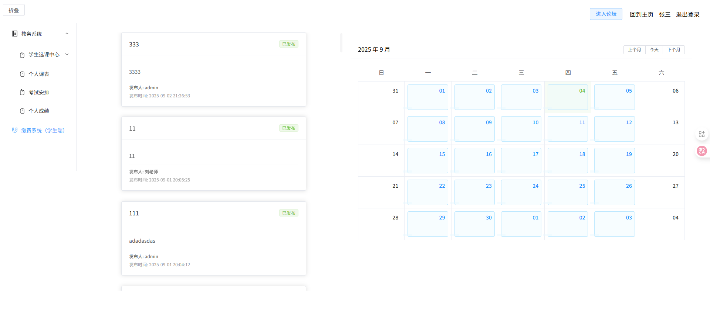

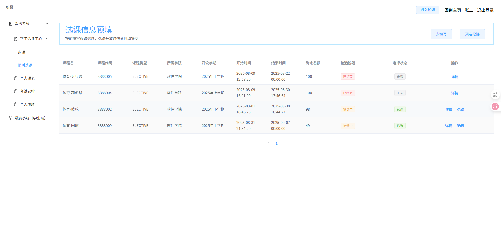

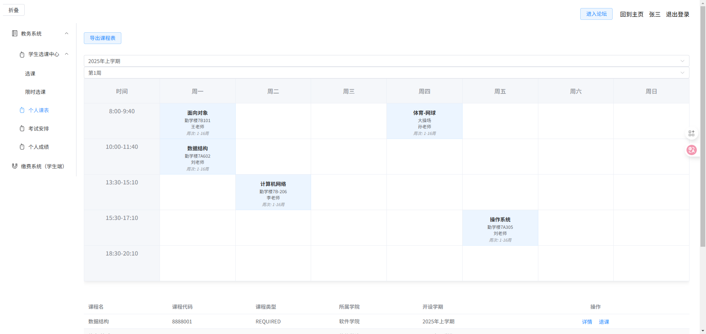

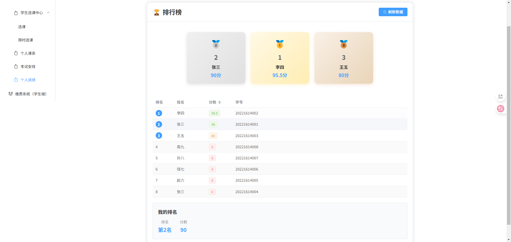

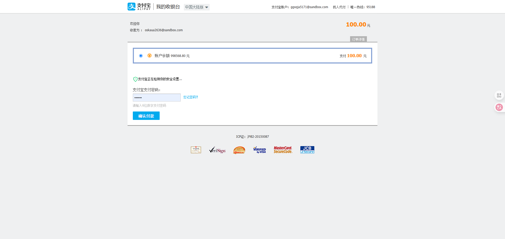

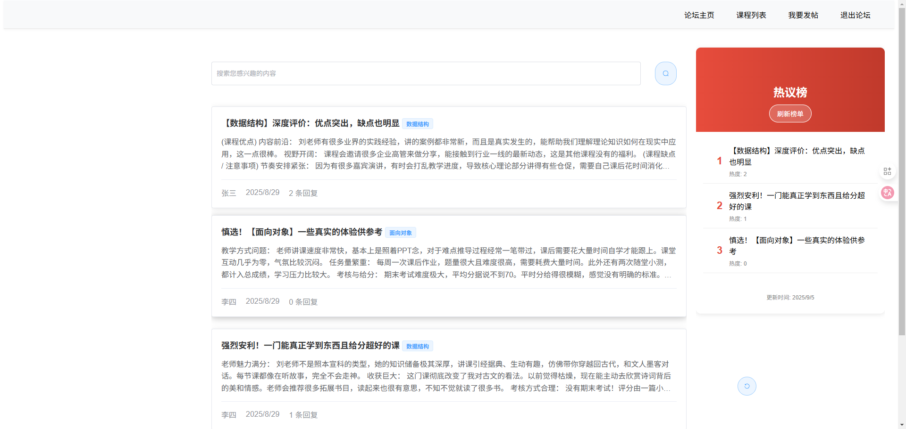

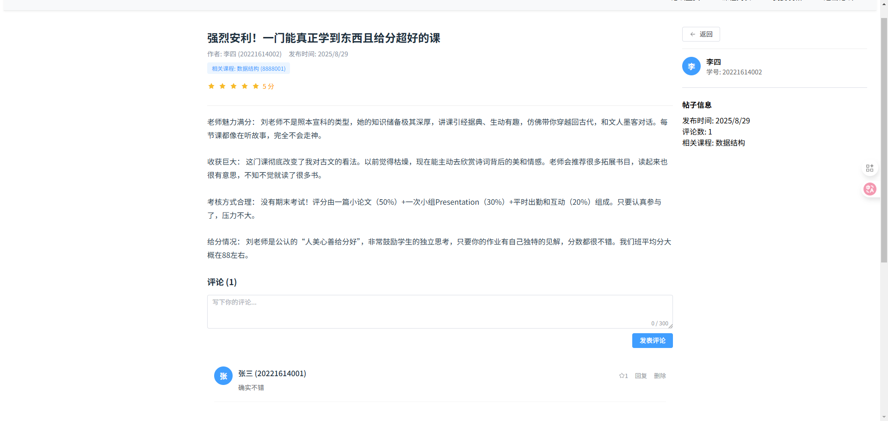

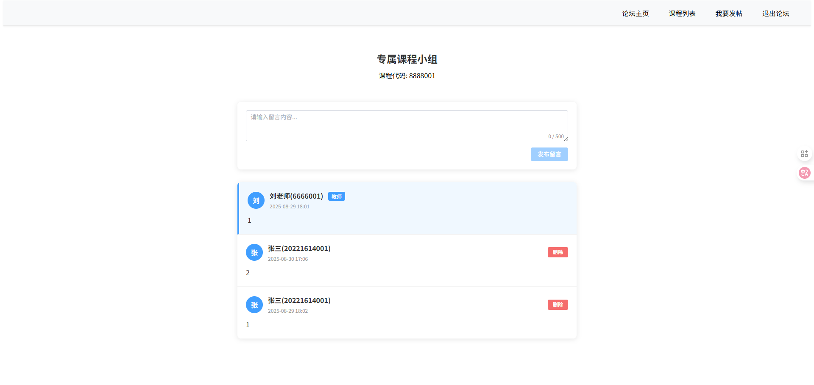

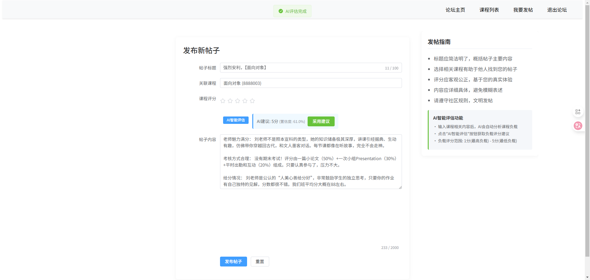

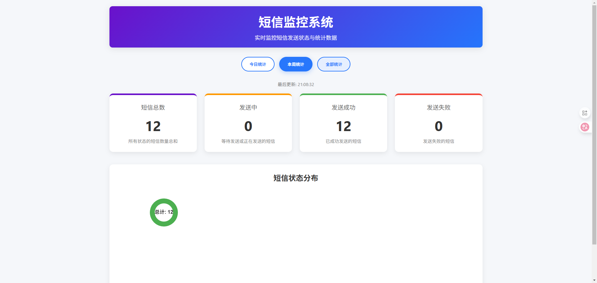

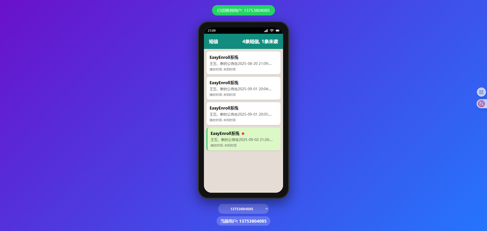

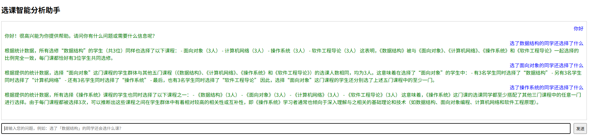
